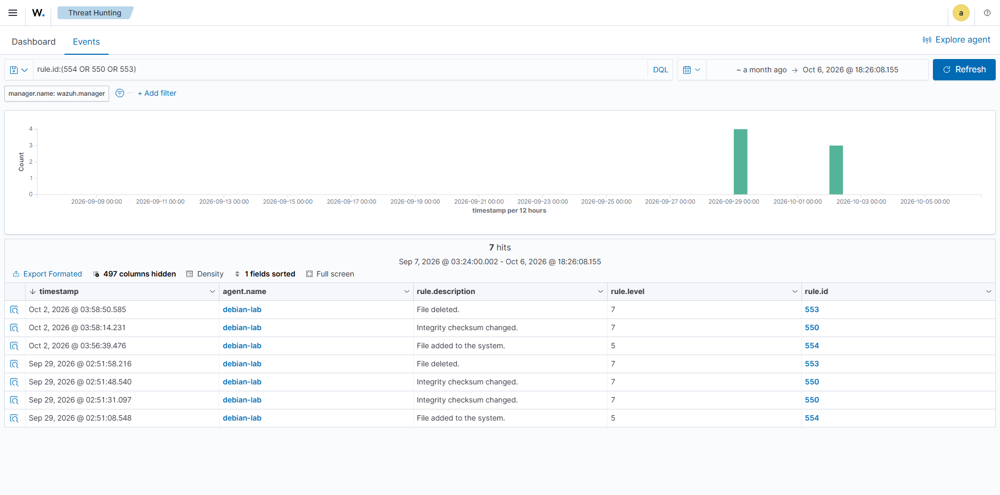
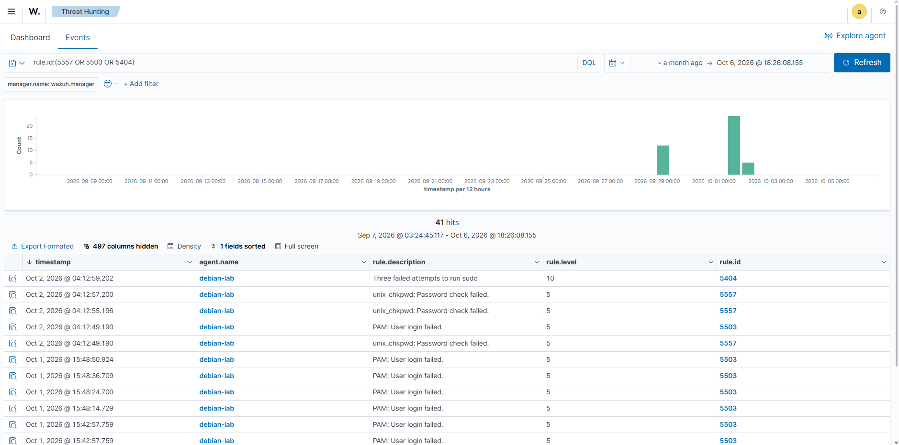

# Wazuh Detection Lab

A home lab for detecting common Linux attacks with **Wazuh**.
I reproduced several typical attack scenarios and checked which Wazuh rules fire on them.

## Architecture

```
Debian VM (VirtualBox)
 ├── wazuh-agent        → collects logs and monitors files
 └── Docker Compose
      └── Wazuh (manager + indexer + dashboard)
```

The agent and the Wazuh server run on the same Debian virtual machine.

## Stack

- Debian (VirtualBox)
- Docker Compose
- Wazuh (single-node)
- wazuh-agent

## Detection Scenarios

| # | Scenario | Rule ID | Description |
|---|---|---|---|
| 1 | SSH brute-force | 5712 | multiple failed SSH login attempts |
| 2 | File Integrity Monitoring | 554 / 550 / 553 | file added / modified / deleted |
| 3 | Failed sudo authentication | 5557 → 5503 → 5404 | chain of events after wrong sudo passwords |
| 4 | Successful SSH login | 5715 | legitimate login, used as a baseline |

See detailed write-ups for each scenario: [docs/scenarios](docs/scenarios)

## Screenshots

### 1. SSH brute-force (rule 5712)


### 2. File Integrity Monitoring (rules 554 / 550 / 553)


### 3. Failed sudo authentication (rules 5557 → 5503 → 5404)


### 4. Successful SSH login (rule 5715)


## Repository Structure

```
├── docker/             # docker-compose for Wazuh (passwords replaced with CHANGE_ME)
├── agent/              # wazuh-agent config (ossec.conf)
├── docs/scenarios/     # scenario descriptions
├── attack-commands/    # commands used to reproduce the attacks
└── screenshots/        # alert screenshots
```

## How to Reproduce

1. Start Wazuh:
```bash
   cd docker
   docker compose up -d
```
2. Install the wazuh-agent on Debian and connect it to the manager.
3. Run the scenarios from `docs/scenarios`.
4. Open the Wazuh Dashboard and review the alerts.

## What I Learned

- Deployed Wazuh with Docker Compose
- Connected an agent and configured log collection
- Saw how individual events combine into rule chains
- Learned to tell attacks apart from legitimate activity

> Passwords in `docker-compose.yml` are replaced with `CHANGE_ME`. Set your own before running.