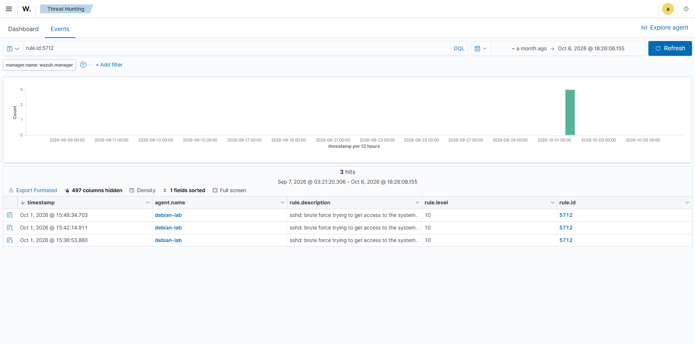

# Scenario 1: SSH Brute-force

## Goal
Simulate an attacker trying to guess SSH credentials by sending many login attempts in a short time.

## How it was done
Ran a password-guessing attack against the Debian VM over SSH using Hydra with a wordlist.
See: [`attack-commands/01-ssh-bruteforce.sh`](../../attack-commands/01-ssh-bruteforce.sh)

## What Wazuh detected
Multiple failed SSH login attempts from the same source in a short window triggered Wazuh's
built-in brute-force detection rule.

- **Rule ID:** 5712
- **Rule description:** sshd: brute force trying to get access to the system
- **Rule level:** 10
- **Agent:** debian-lab

## Screenshot

## Notes
Wazuh correlates several consecutive "Failed password" entries from `/var/log/auth.log`
into a single higher-level alert instead of flagging each failed attempt separately.
