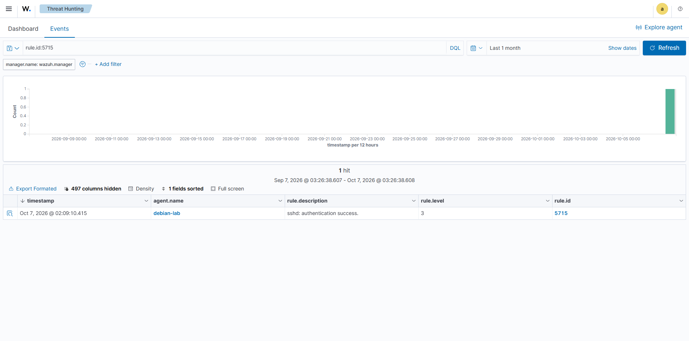

# Scenario 4: Successful SSH Login (Baseline)

## Goal
Capture what a legitimate SSH login looks like in Wazuh, to compare against the
brute-force scenario.

## How it was done
Logged in to the Debian VM over SSH with the correct credentials.
See: [`attack-commands/04-ssh-success-login.sh`](../../attack-commands/04-ssh-success-login.sh)

## What Wazuh detected
- **Rule ID:** 5715
- **Rule description:** Successful SSH login
- **Agent:** debian-lab

## Screenshot

## Notes
Comparing this baseline event with Scenario 1 shows the difference between a single
legitimate login and a burst of failed attempts that Wazuh flags as a brute-force attack.
